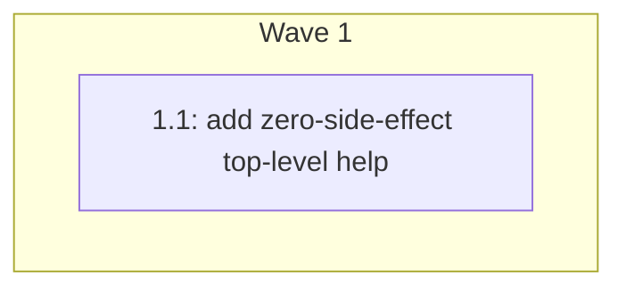

# Plan: CLI help command

## Goal

Implement the approved `docs/specs/2026-07-25-help-command.md` contract as a
small, zero-side-effect addition to the existing standard-library command
dispatcher. The completed CLI will make every supported command and AI
configuration entry discoverable through `basso help`, `basso -h`, and
`basso --help` without changing playback, suggestion, or apply behavior.

## Architecture

Keep help inside `cmd/basso`, beside the existing top-level dispatcher and its
injected dependencies. A static help string and a narrow writer function are
enough: dispatch recognizes the three help spellings before falling through to
playback, validates that no arguments follow them, and writes only to the
injected stdout. This design adds no dependency, filesystem access, provider
construction, audio setup, or runtime state.

## Constraints

- `basso help` accepts no positional arguments, writes help to stdout, and exits
  successfully.
- `basso -h` and `basso --help` are aliases for the same output because they are
  standard command-line discovery paths.
- Help must not read a pattern or sound directory, construct a provider or
  model, open audio, access the network, or create `.basso/` state.
- The output must list these exact invocation forms:
  - `basso play <source.fnl>`
  - `basso <source.fnl>`
  - `basso suggest [flags] <source.fnl> <prompt>`
  - `basso apply <candidate-id>`
  - `basso help`
- The output must briefly describe `play`, `suggest`, `apply`, and `help`, and
  identify the bare-file form as an alias for `play`.
- The output must list the existing suggestion flags `--provider`, `--model`,
  `--timeout`, and `--sounds`, plus their matching configuration variables:
  `BASSO_AI_PROVIDER`, `BASSO_AI_MODEL`, `BASSO_AI_TIMEOUT`,
  `BASSO_OLLAMA_URL`, and `OPENAI_API_KEY`.
- Existing no-argument, unknown-command, play, suggest, and apply behavior must
  remain unchanged.
- Use the existing injected stdout/stderr and command dependencies so tests
  never touch audio, files, providers, or the network.
- Preserve unrelated worktree changes, including the current `.gitignore` and
  pattern edits.
- Keep the project pure Go and leave `gofmt -l .`, `go vet ./...`,
  `go test -race ./...`, and `CGO_ENABLED=0 go build ./...` green.

## Progress

| Task | Wave | Status | Evidence |
|---|---|---|---|
| 1.1 | 1 | pending | — |

## Wave 1 — Top-level help

### Task 1.1: Add zero-side-effect top-level help

**Files:** Modify `cmd/basso/ai_commands.go`,
`cmd/basso/ai_commands_test.go`

**Write-scope:** `cmd/basso/ai_commands.go`,
`cmd/basso/ai_commands_test.go`

**Consumes:** Existing `runCommand(context.Context, []string,
commandDependencies) error`, injected `commandDependencies.stdout`, and current
top-level `suggest` and `apply` dispatch.

**Produces:**

- deterministic top-level help text consumed by `basso help`, `basso -h`, and
  `basso --help`
- help dispatch that rejects trailing arguments before any operational
  dependency can be constructed

**Seams:** Help writes only through the existing injected stdout. Tests provide
sentinel dependency factories that fail if playback, audio, provider, model,
preflight, candidate, filesystem, or network paths are touched.

**Tests:** `TestHelpCommand_ListsAllCommandsAndConfiguration`,
`TestHelpCommand_AliasesMatch`, `TestHelpCommand_HasNoSideEffects`,
`TestHelpCommand_RejectsArguments`

- [ ] Write focused failing tests for complete output, byte-identical aliases,
  no operational dependency calls, and trailing-argument rejection.
- [ ] Run the focused command tests and record the expected RED result.
- [ ] Add a static help document and a pure writer-backed help handler.
- [ ] Dispatch `help`, `-h`, and `--help` before playback fallback while
  preserving every existing command path.
- [ ] Run the focused tests to GREEN, then run the full formatting, vet, race,
  cgo-free build, and diff gates.
- [ ] Install the CLI and smoke-test the three public help entry points.
