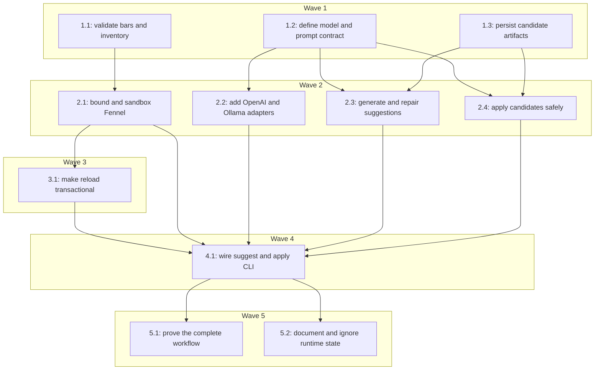

# Plan: transactional AI pattern suggestions

## Goal

Implement the approved transactional AI workflow from
`docs/specs/2026-07-25-transactional-ai-suggestions.md`: Basso can ask an
explicitly configured OpenAI or Ollama model for a complete Fennel candidate,
validate it locally across 16 bars, save it without touching the active source,
and apply it only through a hash-guarded backup-and-rename operation. At the same
time, live playback becomes transactional: invalid edits and later pattern
failures report diagnostics while the last known-good music continues.

## Architecture

The build keeps the existing flat Go application and adds only boundaries that
pass the deletion test:

- `internal/engine` owns musical truth: `Bar`, sound inventory, structural
  validation, bounded/sandboxed Fennel evaluation, and transactional
  `FennelProvider` playback.
- `internal/suggest` owns the AI use case and local candidate artifacts. It
  defines the consumer-side `Model` and `Preflighter` interfaces because there
  are two real model adapters and two real preflight consumers.
- `internal/ai` owns direct HTTP adapters for OpenAI and Ollama plus
  flags-over-environment configuration. It imports the provider-neutral request
  and proposal types but is never imported by the engine.
- `cmd/basso` composes the concrete evaluator, provider adapter, candidate store,
  suggestion service, and applier. The current play alias remains intact.

Two designs were considered. Keeping provider HTTP, prompt construction,
validation, persistence, and CLI parsing together in `cmd/basso` would minimize
packages but make model tests depend on command details and duplicate runtime
validation. Splitting by dependency boundary lets deletion of `internal/ai`
remove all external-API complexity and deletion of `internal/suggest` remove all
candidate-workflow complexity without changing audio. The dependency-boundary
design is chosen because both modules hide substantial behavior and have
independent test strategies.

## Global Constraints

- The project remains pure Go with no cgo and keeps the existing
  `github.com/nyelonong/basso` module path.
- Existing `basso play <file.fnl>` and `basso <file.fnl>` behavior remains
  backward compatible.
- Playback remains fully local and network-independent. Basso performs an
  external request only after an explicit `basso suggest` invocation.
- Fennel remains the pattern language and `pattern(bar)` remains the
  script-to-engine contract.
- The audio device is still opened once per play process and remains open across
  accepted and rejected file revisions.
- A pending source is never made active until it successfully evaluates and its
  returned bar passes structural validation.
- After at least one successful bar, a later compile, evaluation, timeout, or
  validation failure is non-fatal: Basso repeats the last successfully produced
  bar, keeps the audio device open, and reports one diagnostic for that failed
  revision and error.
- An invalid initial source remains fatal and must be rejected before the audio
  sink starts; there is no last known-good bar to repeat at startup.
- Every Fennel evaluation runs with a 250 ms context deadline using gopher-lua's
  `LState.SetContext`. Timeout is a validation failure, never an unbounded wait.
- User Fennel executes with only the base, table, string, and math facilities
  needed by the current patterns plus Basso's `bpm` and `steps` host functions.
  Before user source is evaluated, filesystem, process, environment, module
  loading, and debug entry points (`os`, `io`, `debug`, `package`, `require`,
  `dofile`, and `loadfile`) are unavailable.
- A valid bar has BPM in `[20, 400]`, steps per bar in `[1, 256]`, and at most
  4096 hits. Every hit must have a step in `[0, stepsPerBar)`, finite pan in
  `[-1, 1]`, finite velocity in `[0, 1]`, and exactly one of sample or note.
  Note hits must have a valid scientific-pitch note, length in `[1, 4096]`, and
  instrument `bass`, `brass`, or `pluck`. Sample hits must name a basename from
  the configured sound inventory; path separators and traversal are rejected.
- AI candidate preflight evaluates bars 0 through 15 independently through the
  same evaluator and validator used by playback. All 16 bars must pass.
- Suggestion input source and output source are each limited to 256 KiB. The
  user's prompt is non-empty and limited to 16 KiB. Provider response bodies are
  limited to 512 KiB before JSON decoding.
- Model output is untrusted even when a provider reports schema conformance.
  Only local compilation and validation can make a candidate eligible to save.
- A suggestion may make at most two model requests: the initial proposal and one
  repair request containing local diagnostics if the first proposal fails.
- API credentials come only from environment variables, are never written to
  candidate metadata, and are never printed.
- The model receives only the user's prompt, the selected pattern source, the
  fixed Basso script-API description, the allowed sample/instrument inventory,
  and one fixed valid example. It does not receive other repository files,
  environment variables, credentials, git history, or candidate history.
- AI unit and integration tests use fakes or `httptest` servers. Project gates
  never require network access, a model installation, or paid credentials.
- Generated runtime state lives under `.basso/`, which is gitignored. Source
  patterns remain ordinary user-owned `.fnl` files. Basso creates `.basso/` and
  its subdirectories with mode `0700` and candidate, metadata, and backup files
  with mode `0600`.
- All implementation follows TDD and every future wave leaves `gofmt -l .`,
  `go vet ./...`, and `go test ./...` green.

## Progress

| Task | Wave | Status | Evidence |
|---|---|---|---|
| 1.1 | 1 | complete | reviewed `a71ef22`; integrated `ad418a0` |
| 1.2 | 1 | complete | reviewed `fea7a80`; integrated `34a9eef` |
| 1.3 | 1 | complete | reviewed `2219b3f`; integrated `f9fb151` |
| 2.1 | 2 | complete | reviewed `63b7e80`; integrated `733c827`/`dc74312` |
| 2.2 | 2 | complete | reviewed `2629a4f`; integrated through `56734dd` |
| 2.3 | 2 | complete | reviewed `528876f`; integrated `3b300d0`/`0ec79ec` |
| 2.4 | 2 | complete | reviewed `77a7bf4`; integrated `050492a`/`febcc87` |
| 3.1 | 3 | in-progress | dispatched from `10d9404` |
| 4.1 | 4 | pending | — |
| 5.1 | 5 | pending | — |
| 5.2 | 5 | pending | — |

## Wave 1 — Pure contracts and persistence primitives

### Task 1.1: Define shared bar validation and sound inventory

**Files:** Create `internal/engine/validation.go`,
`internal/engine/validation_test.go`

**Write-scope:** `internal/engine/validation.go`,
`internal/engine/validation_test.go`

**Consumes:** Existing `Hit` from `internal/engine/engine.go` and `parseNote`
from `internal/engine/note.go`

**Produces:**

- `Bar { Hits []Hit; BPM int; StepsPerBar int }` — consumed by Tasks 2.1 and 3.1
- `SoundInventory map[string]struct{}` — consumed by Tasks 2.1, 3.1, and 4.1
- `LoadSoundInventory(path string) (SoundInventory, error)` — consumed by
  Tasks 3.1 and 4.1
- `ValidateBar(bar Bar, inventory SoundInventory) error` — consumed by Task 2.1

**Seams:** Pure validation logic uses unit tests with no seam. Sound-directory
loading is owned filesystem I/O and uses integration tests against `t.TempDir`;
symlinks and non-regular entries are real filesystem fixtures.

**Tests:** `TestValidateBar_AcceptsCurrentPatterns`,
`TestValidateBar_RejectsTempoBounds`,
`TestValidateBar_RejectsStepsBounds`,
`TestValidateBar_RejectsHitCount`,
`TestValidateBar_RejectsStepOutsideBar`,
`TestValidateBar_RejectsNonFinitePanAndVelocity`,
`TestValidateBar_RejectsPanAndVelocityBounds`,
`TestValidateBar_RejectsSampleOutsideInventory`,
`TestValidateBar_RejectsSamplePath`,
`TestValidateBar_RejectsInvalidNote`,
`TestValidateBar_RejectsLengthBounds`,
`TestValidateBar_RejectsInstrument`,
`TestLoadSoundInventory_RegularBasenamesOnly`

- [ ] Write failing table-driven tests for every numeric and hit-shape rule
  copied from the spec.
- [ ] Add `Bar` and `SoundInventory`, keeping `Hit` unchanged.
- [ ] Implement inventory loading that accepts only regular-file basenames and
  rejects a missing, symlinked, or non-directory root.
- [ ] Implement structural validation, including `math.IsNaN`/`math.IsInf`,
  note parsing, exact sample membership, and path-separator rejection.
- [ ] Prove every checked-in pattern evaluates to a shape the validator accepts
  using explicit fixture bars; do not invoke the interpreter in this task.
- [ ] Run the wave-local tests and confirm RED→GREEN evidence.

### Task 1.2: Define the consumer-side model and prompt contract

**Files:** Create `internal/suggest/model.go`,
`internal/suggest/model_test.go`, `internal/suggest/prompt.go`,
`internal/suggest/prompt_test.go`, `internal/suggest/prompt.txt`

**Write-scope:** `internal/suggest/model.go`,
`internal/suggest/model_test.go`, `internal/suggest/prompt.go`,
`internal/suggest/prompt_test.go`, `internal/suggest/prompt.txt`

**Consumes:** The approved script API and privacy boundary from the spec

**Produces:**

- `ModelRequest { Prompt string; Source string; Samples []string; Instruments []string }`
  — consumed by Tasks 2.2 and 3.2
- `Proposal { Summary string; Source string }` — consumed by Tasks 2.2 and 3.2
- consumer-side `Model` interface with
  `Propose(context.Context, ModelRequest) (Proposal, error)` — implemented by
  Task 2.2 and consumed by Task 2.3
- consumer-side `Preflighter` interface with
  `Preflight(context.Context, string, int, int) error` — implemented by Task 2.1
  and consumed by Tasks 2.3 and 2.4
- `RenderPrompt(ModelRequest) (string, error)` using embedded versioned
  `prompt.txt` — consumed by Task 2.2

**Seams:** Prompt rendering is pure logic with snapshot-style exact assertions.
The two-adapter rule is satisfied by the planned OpenAI and Ollama clients.
Interfaces live with their consumers and are exercised only through their
declared methods.

**Tests:** `TestRenderPrompt_ContainsOnlyAllowedContext`,
`TestRenderPrompt_DelimitsSourceAsData`,
`TestRenderPrompt_ListsSortedInventory`,
`TestRenderPrompt_IncludesOneFixedExample`,
`TestRenderPrompt_RejectsEmptyFields`

- [ ] Write failing tests that assert the complete prompt sections and absence
  of environment, repository, history, and credential content.
- [ ] Define the narrow provider-neutral request, proposal, model, and preflight
  contracts with exact method signatures.
- [ ] Add the embedded prompt template instructing complete-source output,
  bounded deterministic `pattern(bar)`, inventory-only assets, and no tools.
- [ ] Render sample names in stable sorted order so request tests and provider
  payloads are deterministic.
- [ ] Reject an empty prompt, source, inventory, or instrument list before
  rendering.
- [ ] Run the wave-local tests and confirm RED→GREEN evidence.

### Task 1.3: Define and persist candidate artifacts

**Files:** Create `internal/suggest/candidate.go`,
`internal/suggest/candidate_test.go`

**Write-scope:** `internal/suggest/candidate.go`,
`internal/suggest/candidate_test.go`

**Consumes:** Schema-v1 candidate shape and permission rules from the spec

**Produces:**

- `ValidationRecord { FirstBar int; LastBar int; TimeoutMSPerBar int; Status string }`
  — consumed by Tasks 2.3, 2.4, and 4.1
- `Metadata { SchemaVersion int; ID string; CreatedAt time.Time; SourcePath string; SoundsPath string; BaseSHA256 string; CandidateSHA256 string; Provider string; Model string; Prompt string; Summary string; Attempts int; Validation ValidationRecord }`
  with the spec's exact JSON tags — consumed by Tasks 2.3, 2.4, and 4.1
- `Candidate { Metadata Metadata; Source []byte }` — consumed by Tasks 2.3,
  2.4, and 4.1
- concrete `Store` returned by
  `NewStore(root string, now func() time.Time) *Store` — consumed by Tasks 2.3,
  2.4, and 4.1
- `Store.Save(Candidate) (Candidate, error)` and
  `Store.Load(id string) (Candidate, error)` — consumed by Tasks 2.3, 2.4,
  and 4.1

**Seams:** Candidate hashing and schema checks are pure unit-tested logic.
Filesystem persistence is an owned store and uses real `t.TempDir` integration
tests. Time is injected at construction so IDs and paths are deterministic.

**Tests:** `TestStore_SaveCreatesSchemaV1Pair`,
`TestStore_SaveUsesTimestampAndCandidateHashID`,
`TestStore_SaveUsesPrivatePermissions`,
`TestStore_SaveIsExclusive`,
`TestStore_LoadRejectsUnknownFields`,
`TestStore_LoadRejectsMalformedMetadata`,
`TestStore_LoadRejectsHashMismatch`

- [ ] Write failing tests for the exact JSON field names, RFC3339Nano time,
  timestamp/hash candidate ID, and all-required/no-additional-fields behavior.
- [ ] Implement SHA-256 helpers and metadata validation without accepting short
  or uppercase hashes.
- [ ] Create `.basso` and subdirectories as `0700`; create `.fnl` and `.json`
  files as `0600` with exclusive semantics.
- [ ] On a partial save failure, remove the newly created half-pair without
  touching any pre-existing candidate.
- [ ] Load with strict JSON decoding and re-hash candidate bytes before return.
- [ ] Run the wave-local tests and confirm RED→GREEN evidence.

### Wave 1 gate

- [ ] Confirm Tasks 1.1, 1.2, and 1.3 touched disjoint write-scopes.
- [ ] Run `gofmt -l .` and require empty output.
- [ ] Run `go vet ./...`.
- [ ] Run `go test ./...`.
- [ ] Record task evidence and regenerate the Progress table from
  `memory-progress.md`.

## Wave 2 — Bounded evaluation, adapters, and use cases

### Task 2.1: Extract a bounded, sandboxed Fennel evaluator

**Files:** Modify `internal/engine/fennel.go`,
`internal/engine/fennel_test.go`; create
`internal/engine/evaluator_test.go`

**Write-scope:** `internal/engine/fennel.go`,
`internal/engine/fennel_test.go`, `internal/engine/evaluator_test.go`

**Consumes:** `Bar`, `SoundInventory`, and `ValidateBar` from Task 1.1

**Produces:**

- `EvaluationPhase` values `compile`, `evaluate`, `timeout`, and `validate` —
  consumed by Task 3.1
- `EvaluationError { Phase EvaluationPhase; Bar int; Err error }` — consumed by
  Task 3.1
- concrete `Evaluator` returned by
  `NewEvaluator(inventory SoundInventory, timeout time.Duration) *Evaluator` —
  consumed by Tasks 3.1 and 4.1
- `Evaluator.Evaluate(context.Context, source string, bar int) (Bar, error)` —
  consumed by Task 3.1
- `Evaluator.Preflight(context.Context, source string, firstBar int, lastBar int) error`
  — satisfies Task 1.2's `Preflighter` and is consumed by Tasks 2.3, 2.4, and 4.1

**Seams:** Fennel/gopher-lua is an embedded interpreter boundary. Integration
tests execute real Fennel through real gopher-lua; context cancellation is
tested with a deliberately infinite script and a bounded test timeout. No mock
interpreter is introduced.

**Model tier:** top

**Tests:** `TestEvaluator_EvaluateCurrentPattern`,
`TestEvaluator_PreflightBarsZeroThroughFifteen`,
`TestEvaluator_UsesFreshStatePerBar`,
`TestEvaluator_RejectsOversizedSource`,
`TestEvaluator_TimesOutInfiniteLoop`,
`TestEvaluator_RemovesFilesystemAndProcessGlobals`,
`TestEvaluator_ClassifiesCompileEvaluateValidateAndTimeoutErrors`

- [ ] Write failing integration tests against real Fennel for successful
  evaluation, fresh per-bar state, each phase, and all 16 preflight bars.
- [ ] Extract the existing compile/evaluate/map behavior into `Evaluator` while
  leaving `PatternProvider.Next` externally compatible.
- [ ] Set a context deadline on every Lua state and classify cancellation as
  `EvaluationPhaseTimeout`.
- [ ] Load the compiler, then remove `os`, `io`, `debug`, `package`, `require`,
  `dofile`, and `loadfile` before evaluating user source; prove attempts to use
  them fail.
- [ ] Route every mapped `Bar` through Task 1.1's validator and enforce the
  256 KiB source limit.
- [ ] Implement preflight as inclusive `firstBar..lastBar`, with a new Lua state
  for each call to `Evaluate`, and reject inverted/negative horizons.
- [ ] Migrate existing evaluator tests to explicit inventories without weakening
  their current sample/note assertions.
- [ ] Run the task tests and full engine package tests.

### Task 2.2: Implement OpenAI and Ollama structured-output adapters

**Files:** Create `internal/ai/config.go`, `internal/ai/config_test.go`,
`internal/ai/openai.go`, `internal/ai/openai_test.go`,
`internal/ai/ollama.go`, `internal/ai/ollama_test.go`

**Write-scope:** `internal/ai/config.go`, `internal/ai/config_test.go`,
`internal/ai/openai.go`, `internal/ai/openai_test.go`,
`internal/ai/ollama.go`, `internal/ai/ollama_test.go`

**Consumes:** `ModelRequest`, `Proposal`, and `RenderPrompt` from Task 1.2

**Produces:**

- `Overrides { Provider string; Model string; Timeout string }` — consumed by
  Task 4.1
- `Config { Provider string; Model string; Timeout time.Duration; OpenAIAPIKey string; OllamaURL *url.URL }`
  — consumed by Task 4.1
- `ResolveConfig(overrides Overrides, getenv func(string) string) (Config, error)`
  with flags-over-environment precedence — consumed by Task 4.1
- concrete `OpenAIClient` returned by
  `NewOpenAIClient(config Config, client *http.Client) *OpenAIClient` and
  concrete `OllamaClient` returned by
  `NewOllamaClient(config Config, client *http.Client) *OllamaClient`; both
  satisfy Task 1.2's `Model` interface and are consumed by Task 4.1

**Seams:** OpenAI and Ollama are external APIs: each adapter gets contract tests
against a real `httptest.Server` and is substituted by a fake `Model` in higher
layers. HTTP transports are injected; OpenAI origin override exists only in an
unexported test constructor, while production stays pinned to the fixed HTTPS
origin. No test calls the internet.

**Model tier:** top

**Tests:** `TestResolveConfig_FlagsOverrideEnvironment`,
`TestResolveConfig_RequiresProviderModelAndOpenAIKey`,
`TestResolveConfig_DefaultsTimeoutAndOllamaURL`,
`TestOpenAIClient_SendsStrictSchemaRequest`,
`TestOpenAIClient_ParsesProposal`,
`TestOllamaClient_SendsStrictSchemaRequest`,
`TestOllamaClient_ParsesProposal`,
`TestClients_RejectRefusalMalformedTruncatedAndOversizedResponses`,
`TestClients_RefuseRedirects`,
`TestClients_RespectContextAndTimeout`

- [ ] Write failing configuration tests for every precedence, default, and
  preflight failure named in the spec.
- [ ] Resolve provider and model without a default model name; parse timeout
  strictly and normalize the Ollama origin.
- [ ] Implement direct `net/http` payloads with the exact no-additional-fields
  `{summary, source}` schema and 512 KiB limited readers.
- [ ] Configure OpenAI only against its fixed HTTPS origin and Ollama only
  against the resolved origin; refuse every redirect.
- [ ] Reject non-2xx status, provider refusal, missing or extra fields,
  truncated JSON, summary over 500 bytes, and source over 256 KiB.
- [ ] Prove authorization headers are sent only by OpenAI and are never present
  in errors.
- [ ] Add compile-time assertions that both concrete clients satisfy
  `suggest.Model`.
- [ ] Run the task contract tests with no network access.

### Task 2.3: Implement bounded suggestion and repair

**Files:** Create `internal/suggest/service.go`,
`internal/suggest/service_test.go`

**Write-scope:** `internal/suggest/service.go`,
`internal/suggest/service_test.go`

**Consumes:** `ModelRequest`, `Proposal`, `Model`, and `Preflighter` from Task
1.2; `Candidate`, `Metadata`, and `ValidationRecord` from Task 1.3

**Produces:**

- `SuggestInput { Provider string; Model string; Prompt string; SourcePath string; SoundsPath string; Source []byte; Samples []string; Instruments []string }`
  — consumed by Task 4.1
- concrete `Service` returned by
  `NewService(model Model, preflighter Preflighter) *Service` — consumed by
  Task 4.1
- `Service.Suggest(context.Context, SuggestInput) (Candidate, error)` — consumed
  by Tasks 4.1 and 5.1

**Seams:** Model is an external dependency replaced by a scripted fake at the
consumer interface. Preflight is deterministic owned logic represented by a
fake for service control-flow tests; Task 5.1 exercises the real evaluator.

**Tests:** `TestService_ValidFirstProposalUsesOneAttempt`,
`TestService_InvalidFirstProposalRepairsOnce`,
`TestService_InvalidRepairCreatesNoCandidate`,
`TestService_PreflightsExactlyBarsZeroThroughFifteen`,
`TestService_RejectsInputBoundsBeforeModel`,
`TestService_MetadataContainsHashesAndProvenance`,
`TestService_DoesNotMutateSource`

- [ ] Write failing fake-model tests proving one call on success and exactly two
  on first-preflight failure.
- [ ] Validate prompt/source/inventory bounds before invoking `Model`.
- [ ] Build the first provider-neutral request from only allowed context.
- [ ] On first preflight failure, build one repair request containing rejected
  source and exact diagnostics; never retry provider/transport failures.
- [ ] Preflight every accepted proposal for inclusive bars 0 through 15.
- [ ] Produce an unsaved `Candidate` with complete schema-v1 metadata,
  base/candidate hashes, attempts, and passed validation record.
- [ ] Return both preflight diagnostics after a failed repair and no candidate.
- [ ] Run service tests with fakes only.

### Task 2.4: Implement hash-guarded backup and atomic apply

**Files:** Create `internal/suggest/apply.go`,
`internal/suggest/apply_test.go`

**Write-scope:** `internal/suggest/apply.go`,
`internal/suggest/apply_test.go`

**Consumes:** `Preflighter` from Task 1.2; `Candidate`, `Metadata`, `Store.Load`,
and validation schema from Task 1.3

**Produces:**

- `ApplyResult { SourcePath string; BackupPath string }` — consumed by Task 4.1
- `PreflighterFactory func(soundsPath string) (Preflighter, error)` — implemented
  by Task 4.1 and replaced by a fake in this task's tests
- concrete `Applier` returned by
  `NewApplier(store *Store, newPreflighter PreflighterFactory, now func() time.Time) *Applier`
  — consumed by Task 4.1
- `Applier.Apply(context.Context, id string) (ApplyResult, error)` — consumed by
  Tasks 4.1 and 5.1

**Seams:** Apply uses real `t.TempDir` files for the success path. An unexported
consumer-side `fileOps` seam has two adapters (`osFileOps` and a failure-injection
test fake) and is exercised at each pre-rename operation. Time is injected.

**Model tier:** top

**Tests:** `TestApplier_AppliesValidCandidate`,
`TestApplier_RefusesStaleBase`,
`TestApplier_RefusesMetadataAndCandidateHashMismatch`,
`TestApplier_RefusesSymlinkAndWrongTypes`,
`TestApplier_RepreflightsBeforeWrite`,
`TestApplier_CreatesExactPrivateBackup`,
`TestApplier_PreservesSourceMode`,
`TestApplier_FailureBeforeRenamePreservesSource`,
`TestApplier_RemovesTemporaryFileOnFailure`

- [ ] Write the complete success test first: strict load, re-hash, preflight,
  backup, same-directory temp, `Sync`, close, rename, and result paths.
- [ ] Refuse unsupported metadata, changed base, changed candidate, missing
  source, symlinked source/candidate/sounds, and wrong path types before backup.
- [ ] Resolve a preflighter from the metadata sounds path and re-run bars 0
  through 15 before filesystem mutation.
- [ ] Create the exact private backup path and bytes before creating the
  replacement temp file.
- [ ] Preserve source permission bits on the replacement, call `Sync`, close,
  and atomically rename within the source directory.
- [ ] Inject failure at backup creation, temp creation, chmod, write, sync, and
  close; prove every pre-rename failure preserves source bytes and removes temp.
- [ ] Never attempt a three-way merge or silently refresh a stale base hash.
- [ ] Run apply tests against real temporary files.

### Wave 2 gate

- [ ] Confirm Tasks 2.1, 2.2, 2.3, and 2.4 touched disjoint write-scopes.
- [ ] Run `gofmt -l .` and require empty output.
- [ ] Run `go vet ./...`.
- [ ] Run `go test ./...`.
- [ ] Record task evidence and regenerate the Progress table from
  `memory-progress.md`.

## Wave 3 — Transactional runtime

### Task 3.1: Make file-backed playback transactional

**Files:** Modify `internal/engine/fennel.go`,
`internal/engine/fennel_test.go`, `internal/engine/fennel_reload_test.go`, `cmd/basso/main.go`,
`cmd/basso/main_test.go`; create `internal/engine/diagnostic.go`,
`internal/engine/diagnostic_test.go`

**Write-scope:** `internal/engine/fennel.go`,
`internal/engine/fennel_test.go`, `internal/engine/fennel_reload_test.go`, `internal/engine/diagnostic.go`,
`internal/engine/diagnostic_test.go`, `cmd/basso/main.go`,
`cmd/basso/main_test.go`

**Consumes:** `Bar`, `SoundInventory`, and `LoadSoundInventory` from Task 1.1;
`Evaluator`, `EvaluationPhase`, and `EvaluationError` from Task 2.1

**Produces:**

- `DiagnosticPhase` values `compile`, `evaluate`, `timeout`, `validate`, and
  `watch`; `Diagnostic { RevisionSHA256 string; Bar *int; Phase DiagnosticPhase; Err error }`; and
  `DiagnosticReporter func(Diagnostic)` — consumed by Task 4.1
- evaluator-backed `New(source string, evaluator *Evaluator, reporter DiagnosticReporter) (*FennelProvider, error)`
  — consumed by engine tests
- evaluator-backed `NewFromFile(path string, evaluator *Evaluator, reporter DiagnosticReporter) (*FennelProvider, error)`
  — consumed by Tasks 4.1 and 5.1
- transactional `FennelProvider.Next` preserving the existing
  `PatternProvider` signature — consumed by the existing engine and Tasks 4.1
  and 5.1

**Seams:** File watching is owned filesystem I/O tested against real temporary
directories and atomic renames. Diagnostics use an injected function seam.
Playback uses the existing fake `AudioSink` and fake clock; the real audio device
is not opened in tests.

**Model tier:** top

**Tests:** `TestNewFromFile_RejectsInvalidInitialSourceBeforeSinkStart`,
`TestFennelProvider_InvalidPendingKeepsActive`,
`TestFennelProvider_ValidAfterRejectedEditActivatesNextBar`,
`TestFennelProvider_LaterActiveFailureRepeatsLastGoodBar`,
`TestFennelProvider_TimeoutRepeatsLastGoodBar`,
`TestFennelProvider_DeduplicatesDiagnostic`,
`TestFennelProvider_WatchesAtomicReplacement`,
`TestFennelProvider_RemoveKeepsActive`,
`TestFennelProvider_NoAudioRestartAcrossRejectAndAccept`

- [ ] Write failing tests for initial rejection, pending rejection, recovery,
  later failure, timeout, defensive-copy fallback, and diagnostic deduplication.
- [ ] Replace source-only state with active, pending, and last-good `Bar` state;
  never promote a pending revision before current-bar evaluation succeeds.
- [ ] Return a defensive last-good copy on later active failure without changing
  `PatternProvider.Next` or returning a fatal error.
- [ ] Validate initial source in the constructor so a bad file is rejected before
  `Engine.Run` calls `AudioSink.Start`.
- [ ] Watch the cleaned parent directory and filter by basename; debounce write,
  create, rename, and remove/replace sequences for 100 ms.
- [ ] Emit revision/bar/phase errors to the injected reporter and suppress
  identical repeats until another revision is observed.
- [ ] Migrate every existing `New` and `NewFromFile` test call to the explicit
  evaluator/reporting constructor contract without weakening assertions.
- [ ] Wire the existing play command to one loaded `SoundInventory`, one
  250 ms `Evaluator`, and a stderr reporter while preserving both play forms.
- [ ] Run race-enabled engine and CLI tests for watcher/reporter state.

### Wave 3 gate

- [ ] Confirm Task 3.1 stayed within its declared write-scope.
- [ ] Run `gofmt -l .` and require empty output.
- [ ] Run `go vet ./...`.
- [ ] Run `go test ./... -race`.
- [ ] Record task evidence and regenerate the Progress table from
  `memory-progress.md`.

## Wave 4 — CLI composition

### Task 4.1: Wire `suggest` and `apply` without regressing play

**Files:** Modify `cmd/basso/main.go`, `cmd/basso/main_test.go`, `go.mod`,
`go.sum`; create `cmd/basso/ai_commands.go`,
`cmd/basso/ai_commands_test.go`

**Write-scope:** `cmd/basso/main.go`, `cmd/basso/main_test.go`,
`cmd/basso/ai_commands.go`, `cmd/basso/ai_commands_test.go`, `go.mod`, `go.sum`

**Consumes:** `SoundInventory`, `LoadSoundInventory`, and `Evaluator` from Tasks
1.1 and 2.1; `DiagnosticReporter` and transactional `NewFromFile` from Task 3.1;
`Config`, `Overrides`, `ResolveConfig`, `OpenAIClient`, and `OllamaClient` from
Task 2.2; `Store` and candidate types from Task 1.3; `Service`, `SuggestInput`,
and `Service.Suggest` from Task 2.3; `Applier`, `ApplyResult`, and
`Applier.Apply` from Task 2.4

**Produces:**

- command dispatch for `play`, the bare-file alias, `suggest`, and `apply` —
  consumed by Tasks 5.1 and 5.2
- exact flags `--provider`, `--model`, `--timeout`, and `--sounds` with
  flags-over-environment resolution — consumed by Task 5.1
- candidate success output containing ID, summary, validation, path, and unified
  diff — consumed by Tasks 5.1 and 5.2
- apply success output containing source and backup paths — consumed by Tasks
  5.1 and 5.2

**Seams:** CLI dependency construction is injected for tests: model factory,
environment lookup, clock, preflighter, store root, stdout/stderr, and play sink.
External providers use fake `suggest.Model` values in command tests. Unified diff
is pure logic tested by output assertions; use the pure-Go
`github.com/pmezard/go-difflib/difflib` package rather than introducing a new
process dependency.

**Model tier:** top

**Tests:** `TestDispatch_PreservesPlayAndBareAlias`,
`TestSuggestCommand_ValidatesConfigurationBeforeSourceRead`,
`TestSuggestCommand_NeverStartsAudio`,
`TestSuggestCommand_SavesCandidateAndPrintsUnifiedDiff`,
`TestSuggestCommand_ProviderFailureCreatesNoCandidate`,
`TestApplyCommand_PrintsSourceAndBackup`,
`TestApplyCommand_StaleCandidateLeavesSource`,
`TestCommandUsageAndArgumentErrors`

- [ ] Write failing dispatch tests covering all four command forms and every
  documented argument error.
- [ ] Refactor command selection without changing current `run` play behavior or
  its fake-provider/fake-sink tests.
- [ ] Parse AI flags with standard-library `flag.FlagSet`; resolve configuration
  before reading the source or inventory and instantiate exactly one selected
  concrete model client.
- [ ] Resolve `--sounds` relative to invocation directory, load regular
  basenames, and construct one 250 ms evaluator for suggestion; provide apply a
  factory that constructs an evaluator from the candidate metadata sounds path.
- [ ] Run `Service.Suggest`, save through `Store`, and print the exact success
  fields plus unified diff; never write the source or open audio.
- [ ] Run `Applier.Apply` by candidate ID and print exact source/backup paths.
- [ ] Bound prompt/source before model invocation and route all errors to stderr
  without credentials or authorization headers.
- [ ] Add only the pure-Go diff dependency, run `go mod tidy`, and prove
  `CGO_ENABLED=0 go build ./...` remains green.
- [ ] Run CLI tests and all existing play tests.

### Wave 4 gate

- [ ] Run `gofmt -l .` and require empty output.
- [ ] Run `go vet ./...`.
- [ ] Run `go test ./... -race`.
- [ ] Run `CGO_ENABLED=0 go build ./...`.
- [ ] Confirm no command test contacted a real provider or opened a real audio
  device.
- [ ] Record task evidence and regenerate the Progress table from
  `memory-progress.md`.

## Wave 5 — End-to-end proof and user contract

### Task 5.1: Prove suggest, apply, and live activation end to end

**Files:** Create `cmd/basso/ai_workflow_test.go`

**Write-scope:** `cmd/basso/ai_workflow_test.go`

**Consumes:** Command dispatch and dependency-injection seams from Task 4.1;
`Service.Suggest` from Task 2.3; `Applier.Apply` from Task 2.4; transactional
`NewFromFile` from Task 3.1

**Produces:** End-to-end regression proof for the complete local workflow,
consumed by the branch finish gate

**Seams:** The workflow uses a fake `Model`, real Fennel evaluator, real
candidate files, real atomic filesystem replacement, real fsnotify watcher,
fake `AudioSink`, and fake engine clock. The external API boundary is the only
fake outside audio/time.

**Model tier:** top

**Tests:** `TestAIWorkflow_SuggestApplyAndActivateAtNextBar`,
`TestAIWorkflow_InvalidGeneratedRevisionNeverInterruptsActiveAudio`,
`TestAIWorkflow_StaleCandidateCannotOverwriteManualEdit`

- [ ] Start from a real temporary Fennel file and sound inventory with an active
  provider, fake sink, and controllable clock.
- [ ] Run `suggest` with a fake model and prove the source remains byte-identical
  while a validated candidate pair and diff are produced.
- [ ] Run `apply`, prove the exact backup, trigger real fsnotify, advance one bar,
  and prove the new hits schedule with one audio start and no teardown.
- [ ] Exercise an invalid generated revision through both bounded repair failure
  and live rejection; prove current audio continues.
- [ ] Modify the source between suggest and apply and prove stale refusal
  preserves the manual edit.
- [ ] Run this file repeatedly and with `-race` to catch watcher timing leaks.

### Task 5.2: Document consent, review, recovery, and local state

**Files:** Modify `.gitignore`, `README.md`

**Write-scope:** `.gitignore`, `README.md`

**Consumes:** Final command syntax, output, and error behavior from Task 4.1

**Produces:** User-facing installation-free AI workflow and ignored `.basso/`
runtime-state contract, consumed by branch smoke and release review

**Seams:** Documentation is verified by exact command and environment-name
greps plus a human readability review. No runtime seam.

**Tests:** Documentation contract checks for `basso suggest`, `basso apply`,
`BASSO_AI_PROVIDER`, `BASSO_AI_MODEL`, `OPENAI_API_KEY`,
`BASSO_OLLAMA_URL`, candidate review, stale refusal, backup path, and local
validation

- [ ] Ignore only `.basso/`; do not ignore user `.fnl` patterns.
- [ ] Document explicit cloud consent and exactly what selected source context is
  sent.
- [ ] Document OpenAI and local Ollama configuration without hardcoding a model
  name.
- [ ] Show suggest, candidate diff/review, apply, backup recovery, and stale-base
  refusal commands.
- [ ] State that playback stays offline, model output is untrusted, and local
  validation runs before save, apply, and live activation.
- [ ] Keep existing install, play, and development instructions intact.

### Wave 5 gate

- [ ] Confirm Tasks 5.1 and 5.2 touched disjoint write-scopes.
- [ ] Run `gofmt -l .` and require empty output.
- [ ] Run `go vet ./...`.
- [ ] Run `go test ./... -race -count=3`.
- [ ] Run `CGO_ENABLED=0 go build ./...`.
- [ ] Confirm `git status --short` contains no generated `.basso/` artifacts.
- [ ] Verify README command/environment contract greps.
- [ ] Record task evidence and regenerate the Progress table from
  `memory-progress.md`.
